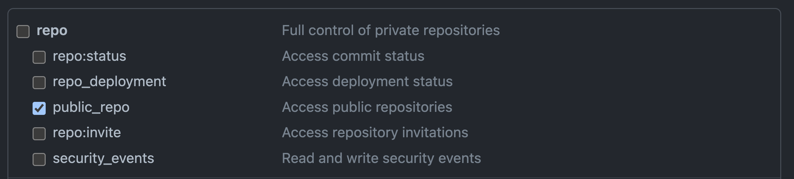
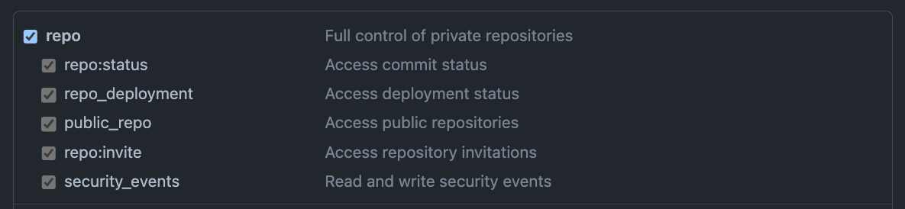

# github-repo-info

An action to update your Github repository information.

## Usage

1. Create a Classic Personal Access Token.
The access token requires repository permission in order to edit metadata.
* `repo:public_repo` scope for public repositories.

* `repo` scope for private repositories.


2. Configure your PAT to your repository or organization secrets(ex: `PAT_TOKEN`).

3. Add an YAML file(ex: `metadata.yml`) for repository configuration.
Available options can be found below in the [#options](#options) section.

4. Add step in your pipeline.
```yml
steps:
  - name: Update Github repo information
    uses: Darkborderman/github-actions/github-repo-info@master
    env:
      YML_PATH: metadata.yml
      GH_TOKEN: ${{ secrets.PAT_TOKEN }}
```

## Options

Available options are under nested `github` section.

| Name | Type | Example values |
| --- | -- | -- |
| description | string | Github action for general purposes. |
| enable_discussions | bool | false |
| enable_issues | bool | false |
| enable_projects | bool | false |
| enable_wiki | bool | false |
| homepage | string | https://github.com/Darkborderman/github-actions |
| template | bool | false |
| topics | list of strings | ["github-action"] |

## Design thoughts

### Why this action exists

I have many template repos that are similiar and are overwhelmed by setting each repos' Github configurations.
